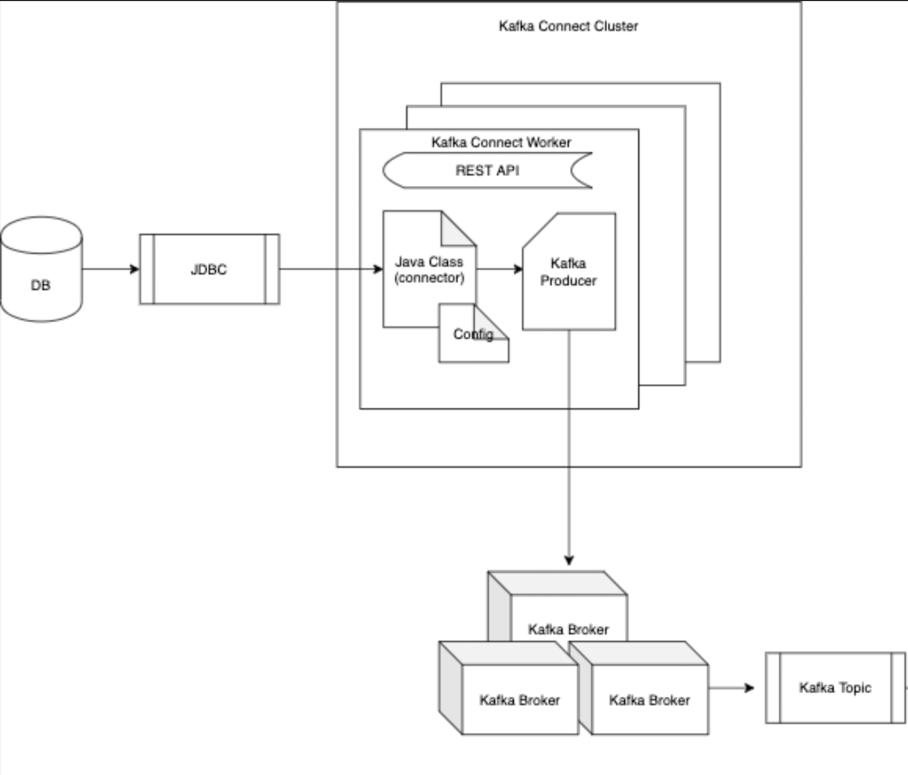

# kafka-connect

This is a Java application using docker and terraform to run kafka connect 

### Architecture

This POC shows the current architecture


## Getting started

These instructions will get you a copy of the project up and running on your local machine for development and testing purposes. The docker-compose file contains Zookeeper, Kafka, Kafka-connect and Postgres images. 

#### Database

The postgres DB will initialize the scripts located [here](./connector/pgsql_init). You can connect locally to the DB environment using [DataGrip](https://www.jetbrains.com/datagrip/download) with the connection `jdbc:postgresql://localhost:5432/postgres`. The credentials can be found here [docker-compose](./docker-compose.yml)

#### Postman

Import the [postman collection](./postman/kafka-connect-local.postman_collection.json) to interact with the connector (Get, Read)
Once terraform is setup, the TF scripts will do what we are doing in postman

## Prerequisites

You must have the below external dependencies in order to run this project locally:

```
Java 11
Maven
Docker
Docker-compose
```

You might need to add these to your host file (`/etc/hosts`)
```
127.0.0.1       kafka
127.0.0.1       postgres
```

## Installing

Step by step instructions on how to get a working version of the project on your local machine

- Clone repo
- Run the following commands
- Install Kafka-connect provider for TF by running this [script](./script/install_kafka_connect_plugin.sh)

> mvn clean install -Ddependency-check.skip=true -Dmaven.test.skip=true

> docker-compose up

# Running the tests

An explanation on how to run any automated tests that relate to the project. WIP

# Clean up

remove containers & volumes
> docker-compose down -v 

remove any unused containers 
> docker system prune -a

remove any unused volumes 
> docker volume prune

### Debug help

View the container logs:
 `docker-compose logs <SERVICE>`
> Example: `docker-compose logs kafka-connect`

Switch on tracing for TF logs 
> export TF_LOG=TRACE

Start services separately
> kafka connect: `docker-compose up kafka-connect`
> terraform: `docker-compose up terraform`

Run Terraform 
> cd tf

> terraform fmt

> terraform init

> terraform plan

